# Spring Security OAuth RCE (CVE-2016-4977) 漏洞分析

## 漏洞介绍

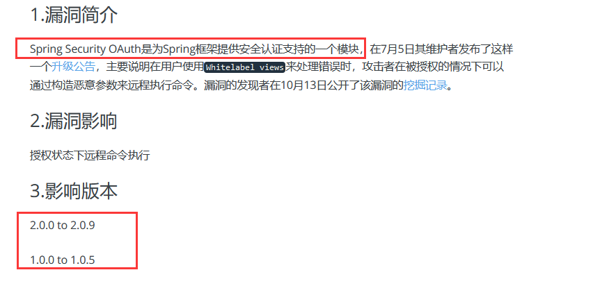

## 环境搭建

`这里是使用window的idea搭建`下载源代码，直接导入工程启动就OK。[源代码下载地址](http://secalert.net/research/cve-2016-4977.zip)。访问`127.0.0.1:8080`


## 漏洞复现

访问`http://127.0.0.1:8080/oauth/authorize`页面进行认证登录

用户名是：`user` 密码是：`password`

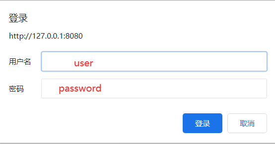

原因是因为配置文件`application.properties`里面写了

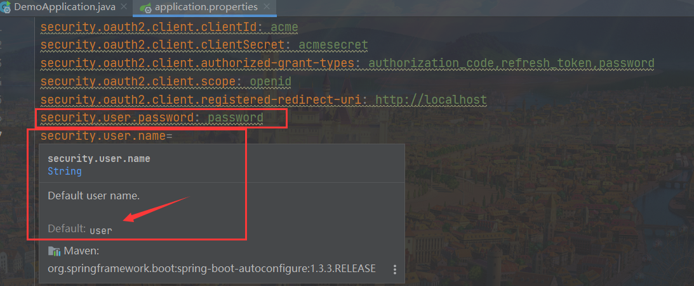

登录成功之后访问`http://127.0.0.1:8080/oauth/authorize?response_type=token&client_id=acme&redirect_uri=hellotom`

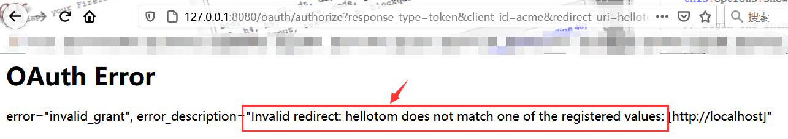

发现这里展示出了`hellotom `，而利用点就是这里，我们使用`SpEL`表达式，进行测试。输入`redirect_uri=${1%2b1}`

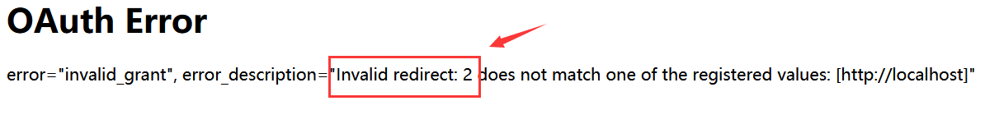

成功执行成`2`
，接下来我们弹一个计算器exp:`redirect_uri=${new%20java.lang.ProcessBuilder(new%20java.lang.String(new%20byte[]{99,97,108,99})).start()}`


成功执行

## 漏洞分析

漏洞的触发点是在`/spring-security-oauth/spring-security-oauth2/src/main/java/org/springframework/security/oauth2/provider/endpoint/WhitelabelErrorEndpoint.java`

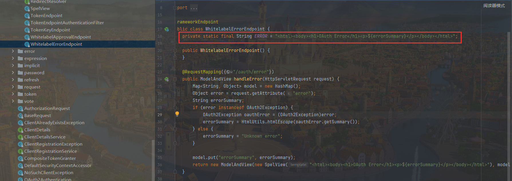

可以看到程序通过`oauthError.getSummary()`来获取错误信息

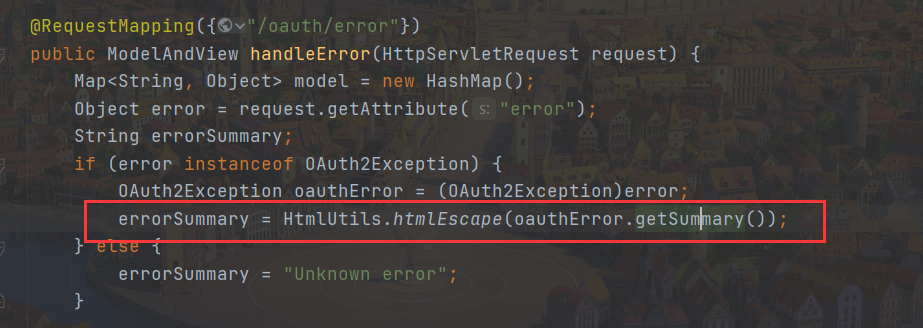

然后将我们的请求参数，装入`model`中，再用`SpelView`进行渲染。

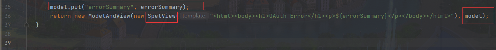

跟进这个`SpelView`方法

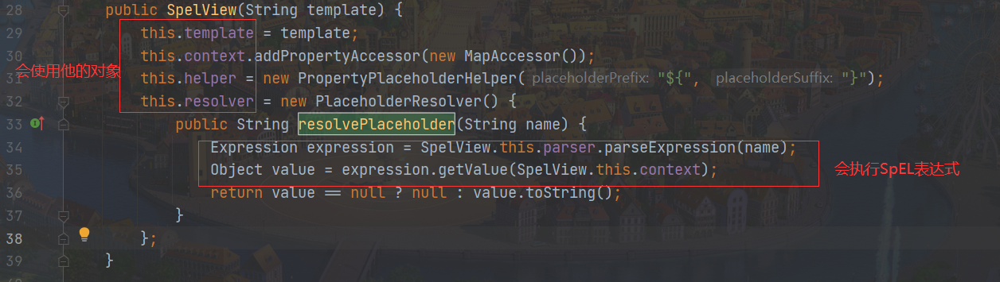

发现下面这句话就是可以执行SpEL表达式，但是前面的变量使用this，说明会使用其对象。

```java
Expression expression = SpelView.this.parser.parseExpression(name);
Object value = expression.getValue(SpelView.this.context);
```

然后我们发现`render`方法使用了其变量

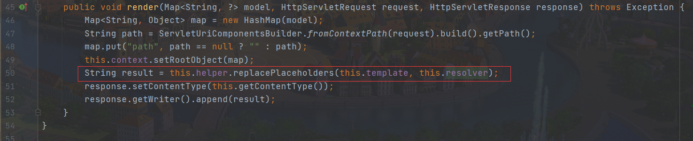

跟进`replacePlaceholders`方法


这个函数`parseStringValue`是个递归，也就是说如果表达式的值中有`${xxx}`这样形式的字符串存在，就会再取`xxx`作为表达式来执行。是调用`resolvePlaceholder`方法

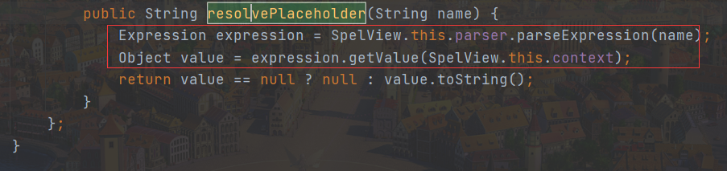

然后我们动态调试一下

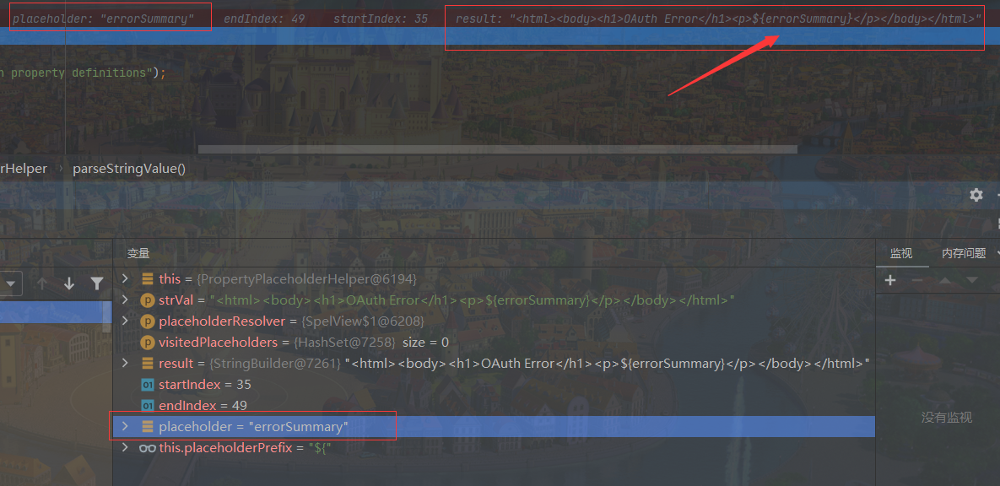

可以看到是去掉了`${}`

第一次内容是`errorSummary`就执行

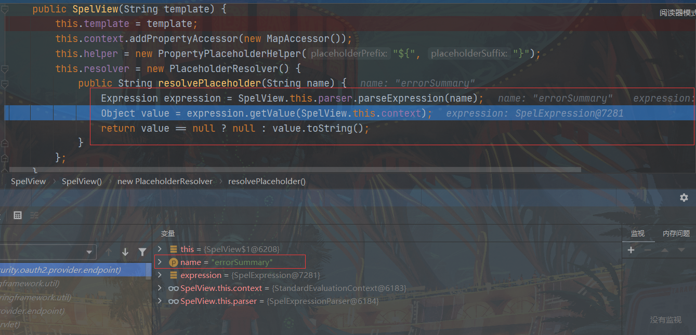

第二次就是我们传递exp并且去掉了`${}`

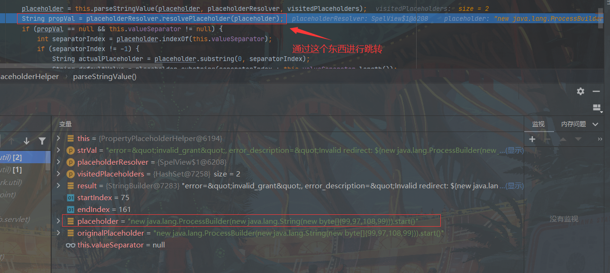

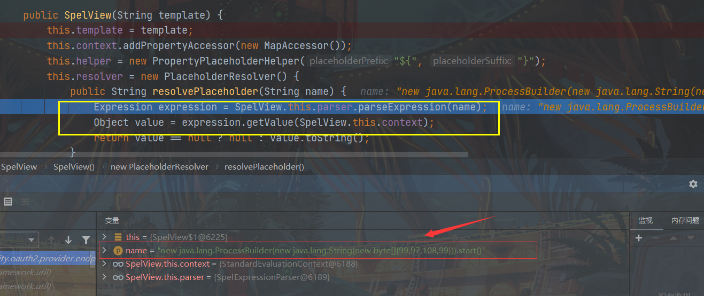

## 官方修复

https://github.com/spring-projects/spring-security-oauth/commit/fff77d3fea477b566bcacfbfc95f85821a2bdc2d

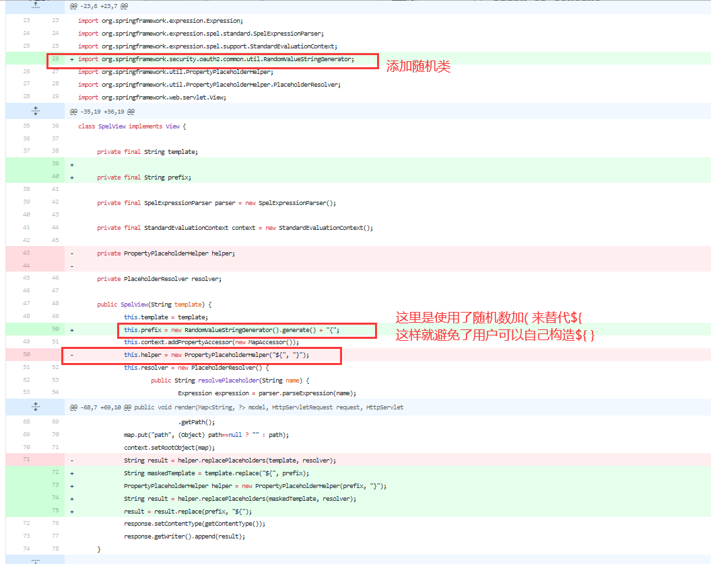

`不过这个Patch有一个缺点：`RandomValueStringGenerator`生成的字符串虽然内容随机，但长度固定为6，所以存在暴力破解的可能性。`

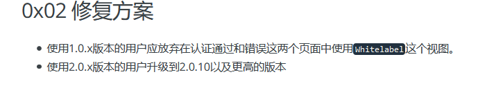

## 参考

> https://paper.seebug.org/70/