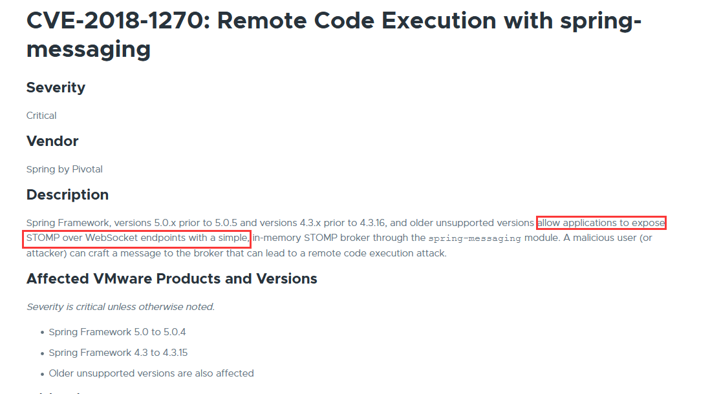
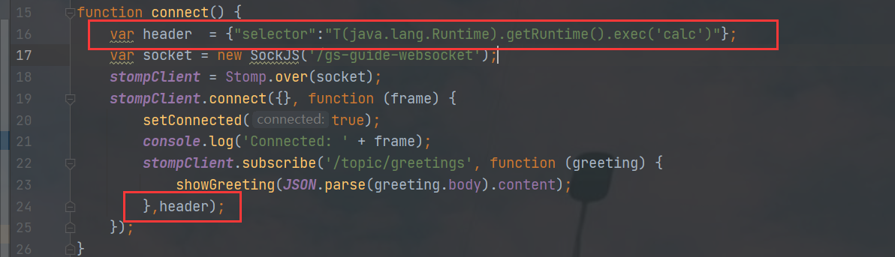
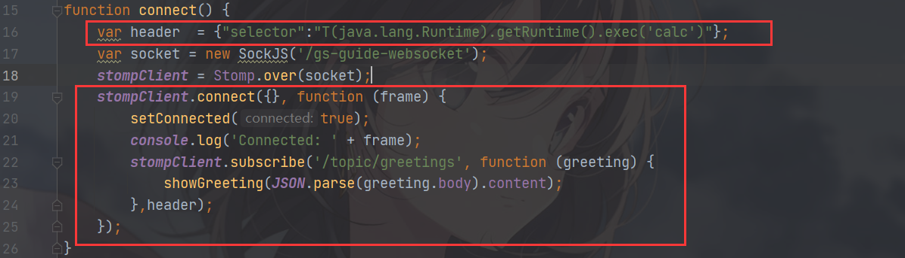
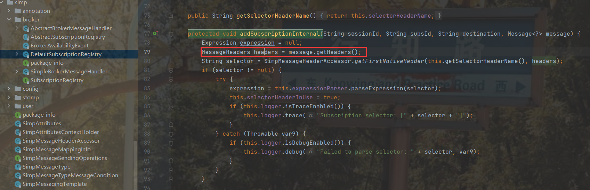
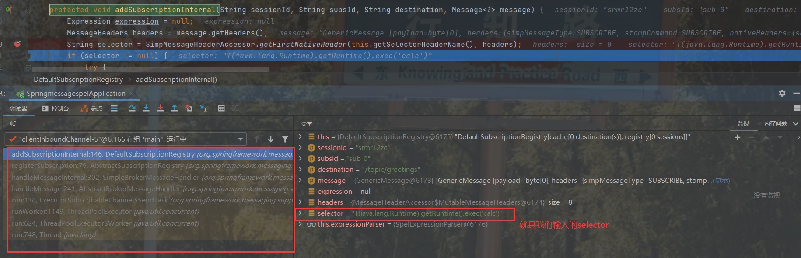
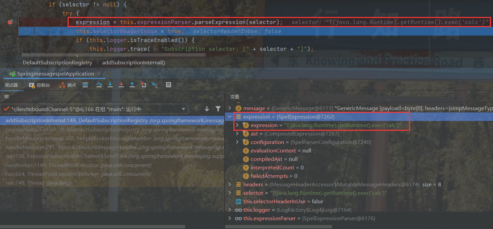
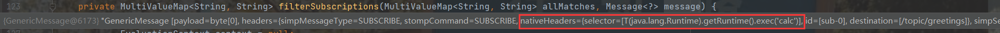
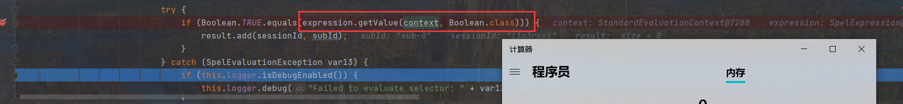

# CVE-2018-1270

## 漏洞介绍

2018年4月5日漏洞公布： https://pivotal.io/security/cve-2018-1270

漏洞影响版本:

1. Spring Framework 5.0 to 5.0.4
2. Spring Framework 4.3 to 4.3.14
3. Older unsupported versions are also affected

Spring框架中通过spring-messaging模块来实现STOMP（Simple Text-Orientated Messaging
Protocol），STOMP是一种封装WebSocket的简单消息协议。攻击者可以通过建立WebSocket连接并发送一条消息造成远程代码执行。

## 环境搭建

使用github地址搭建 https://github.com/Venscor/CVE-2018-1270

然后修改`app.js`

## 漏洞复现

`制作的gif太垃圾了~~`

可以看到成功执行了弹出计算器

## 漏洞分析

我们在靶机中点击Connect后，在app.js中，有如下代码，会建立起Websocket连接：

其中`header`中可以指定了`selector`
，根据 [Stomp Protocol Specification, Version 1.0](https://stomp.github.io/stomp-specification-1.0.html)，通过指定对应的`selecttor`，可以对订阅的信息进行过滤：

然后我们寻找漏洞代码位置。

在`org/springframework/messaging/simp/broker/DefaultSubscriptionRegistry.java` 对这个header参数进行了接受和处理：

在我框框下面有一句`String selector = SimpMessageHeaderAccessor.getFirstNativeHeader(this.getSelectorHeaderName(), headers);`
我们就去看看这个`selector`是什么，通过调试去查看

发现是`T(java.lang.Runtime).getRuntime().exec('calc')`也就是命令执行的语句

查看调用栈，发现web应用在`handleMessageInternal`对消息进行处理，在`registerSubscription`中注册用户信息，最后调用`addSubscriptionInternal`对`header`
参数进行处理，并对`selector`进行解析并将其保存到这次会话中。

而这一步就将表达式存放到`expression`中

而要执行这个表达式，我们就只需要去调用`getValue()`方法执行

可以看到`context`的值来自`message`,而message中就有我们的命令执行

然后我们跟到这一步就直接执行了

官方介绍：点击`send`向服务器发送任意消息，Spring在向用户分发消息的时候会调用`filterSubscriptions`
对信息进行过滤，就会执行命令`expression.getValue(context, Boolean.class))`

## 官方修复

漏洞本质在获得了非法的`context`从而执行了SpEL表达式。官方修复是将`context`替换成`messageEvalContext`，而使用这个`messageEvalContext`
，就可以阻止`java.lang.Runtime`和`java.lang.ProcessBuilder`等类的解析，从而避免了执行命令。

## 参考

> https://xz.aliyun.com/t/2252
>
>https://blog.csdn.net/pacosonswjtu/article/details/51914567

