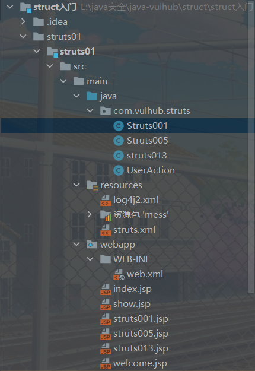

# Struts02漏洞学习

>前段时间就开始学习java安全了，之前分析过spring框架的spel表达式注入，都是使用构造好的环境。所有在环境搭建方面没有花费很多时间，于是就开始了Struts框架漏洞学习。

**Struts框架**可以说是漏洞最多的框架，而基本上是使用`OGNL表达式注入`其实就有点和`EL`表达式，都是为了方便写代码。。。可能我是这么理解的。

[OGNL表达式介绍](https://www.cnblogs.com/renchunxiao/p/3423299.html)

还有说明一下，这里的环境都是自己搭建的，使用花费了我好多时间。。。（因为`struts.xml`配置文件前面多了一个空格导致环境出问题。。还是自己tcl）这里推荐去了解一下Struts02框架。简简单单的学习一下就OK。

[Struts2框架基础](https://www.cnblogs.com/cenyu/p/6219894.html)可以看文章也可以看视频，我比较笨就看的视频加看文章。[2020最新Struts2框架教程——SSH系列](https://www.bilibili.com/video/BV1tp4y1v7gc)

**接下来就开始我们的Struts02漏洞学习**
之前看了一个文章比较好，可以说是Struts2漏洞的原理吧。。。
[Struts2漏洞利用原理及OGNL机制研究](https://xz.aliyun.com/t/225#toc-0)

## 下面是搭建搭建
漏洞版本去官网下载就可以
[漏洞版本](http://archive.apache.org/dist/struts/binaries/)

## TODO
分析各个s2 漏洞 
s2-62 和新的 [https://mc0wn.blogspot.com/2022/11/rce-on-apache-struts-2530.html](https://mc0wn.blogspot.com/2022/11/rce-on-apache-struts-2530.html)

