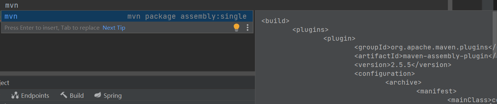

# java-maven打包学习

>之前提供spring写了一个shiro扫描key的工具，可惜简单的打包好像不行，因为有依赖包等等，因为我是提供spring框架提供的web服务去扫描的。今天就来填坑。。。。

之前的打包一运行就报错。。非常难受。然后百度了一下原来是因为没有配置META-INF文件，所以在启动jar的时候找不到主类。而META-INF文件里面就配置了jar启动的主类和其他信息(Class-Path)。所以可以理解为启动jar的时候先去META-INF文件里面读配置然后执行java代码。你没有配置当然找不到主类咯。

然后就是来学习maven打包方式。

### maven命令

1、mvn compile 编译,将Java 源程序编译成 class 字节码文件。

2、mvn test 测试，并生成测试报告

3、mvn clean 将以前编译得到的旧的 class 字节码文件删除

4、mvn pakage 打包,动态 web工程打 war包，Java工程打 jar 包。

5、mvn install 将项目生成 jar 包放在仓库中，以便别的模块调用

6、mvn clean install -Dmaven.test.skip=true  抛弃测试用例打包

### 配置一

使用maven-jar-plugin和maven-dependency-plugin插件打包

通过**mvn package**指令打包

```xml

<build>
	<plugins>
 
		<plugin>
			<groupId>org.apache.maven.plugins</groupId>
			<artifactId>maven-jar-plugin</artifactId>
			<version>2.6</version>
			<configuration>
				<archive>
					<manifest>
						<addClasspath>true</addClasspath>
						<classpathPrefix>lib/</classpathPrefix>
						<mainClass>com.xxg.Main</mainClass>
					</manifest>
				</archive>
			</configuration>
		</plugin>
		<plugin>
			<groupId>org.apache.maven.plugins</groupId>
			<artifactId>maven-dependency-plugin</artifactId>
			<version>2.10</version>
			<executions>
				<execution>
					<id>copy-dependencies</id>
					<phase>package</phase>
					<goals>
						<goal>copy-dependencies</goal>
					</goals>
					<configuration>
						<outputDirectory>${project.build.directory}/lib</outputDirectory>
					</configuration>
				</execution>
			</executions>
		</plugin>
	</plugins>
</build>
```

maven-jar-plugin用于生成META-INF/MANIFEST.MF文件的部分内容，

<mainClass>com.xxg.Main</mainClass>指定MANIFEST.MF中的Main-Class，

<addClasspath>true</addClasspath>会在MANIFEST.MF加上Class-Path项并配置依赖包，

<classpathPrefix>lib/</classpathPrefix>指定依赖包所在目录。


### 配置二

使用maven-assembly-plugin插件打包

通过**mvn package assembly:single**指令打包 

```xml
<build>
	<plugins>
		<plugin>
			<groupId>org.apache.maven.plugins</groupId>
			<artifactId>maven-assembly-plugin</artifactId>
			<version>2.5.5</version>
			<configuration>
				<archive>
					<manifest>
						<mainClass>com.xxg.Main</mainClass>
					</manifest>
				</archive>
				<descriptorRefs>
					<descriptorRef>jar-with-dependencies</descriptorRef>
				</descriptorRefs>
			</configuration>
		</plugin>
	</plugins>
</build>
```

### 配置三

使用maven-shade-plugin插件打包

通过**mvn package**指令打包

```xml
 
<build>  
    <plugins>  
  
        <plugin>  
            <groupId>org.apache.maven.plugins</groupId>  
            <artifactId>maven-shade-plugin</artifactId>  
            <version>2.4.1</version>  
            <executions>  
                <execution>  
                    <phase>package</phase>  
                    <goals>  
                        <goal>shade</goal>  
                    </goals>  
                    <configuration>  
                        <transformers>  
                            <transformer implementation="org.apache.maven.plugins.shade.resource.ManifestResourceTransformer">  
                                <mainClass>com.xxg.Main</mainClass>  
                            </transformer>  
                        </transformers>  
                    </configuration>  
                </execution>  
            </executions>  
        </plugin>  
  
    </plugins>  
</build>  
```

这里自己喜欢第二个方法，如果记不住可以设置代码块。。



>参考:
>
>https://blog.csdn.net/weixin_42248302/article/details/100886727
>
>https://blog.csdn.net/sdrfengmi/article/details/87191944

