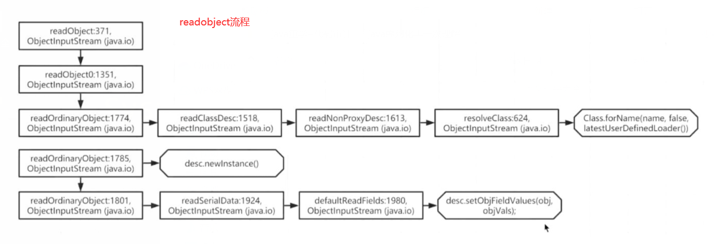

## 流程：

ObjectInputSteram.readObject()

readObject0()

readOrdinaryObject()

desc = readClassDesc(false)

descriptor = readNonProxyDesc(unshared)

readDesc = readClassDescriptor()

cl = resolveClass(readDesc)

filterCheck(cl, -1)

desc.initNonProxy(readDesc, cl, resolveEx, readClassDesc(false))
各種初始化、檢查 suid 等

return desc

return descriptor

obj = desc.isInstantiable() ? desc.newInstance() : null

readSerialData(obj, desc)

slotDesc.invokeReadObject(obj, this)

readObjectMethod.invoke(obj, new Object[]{ in })
