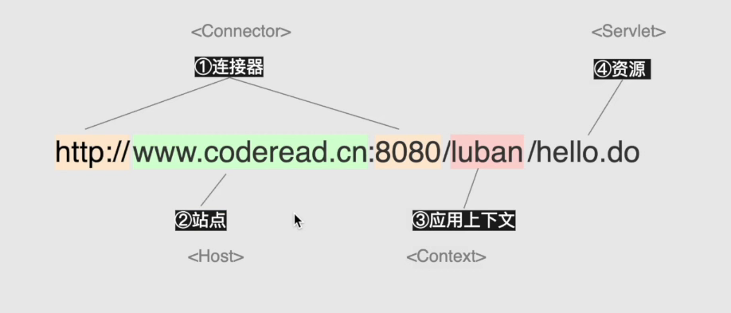
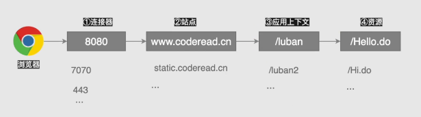
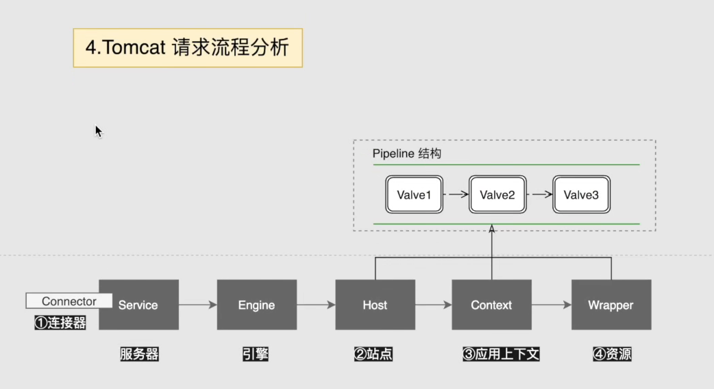
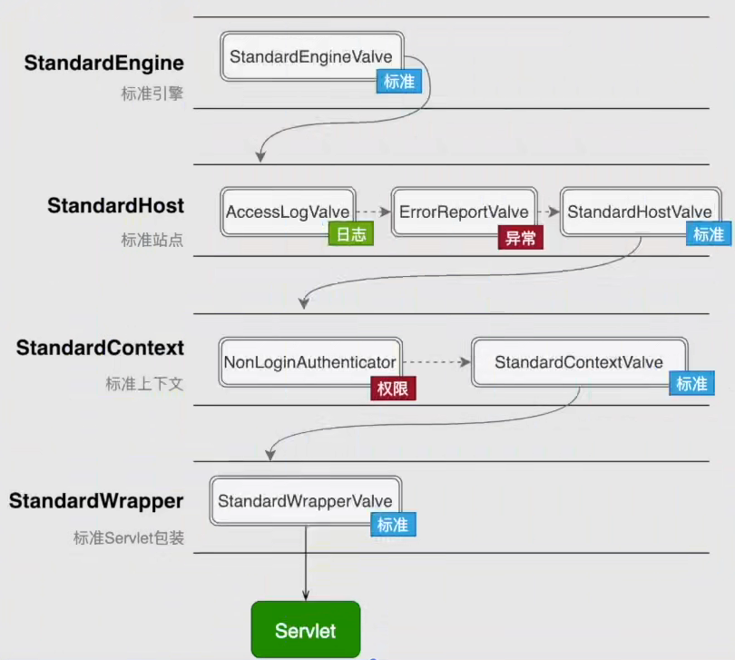

# 深入学习tomcat

## tomcat核心组件



## 核心组件的协助过程



## conf/server.xml

```xml 
<?xml version="1.0" encoding="UTF-8"?>

<Server port="8005" shutdown="SHUTDOWN">
  <Service name="Catalina">
<!--    可以修改Catalina名字-->
    <Connector port="8080" protocol="HTTP/1.1"
               connectionTimeout="20000"
               redirectPort="8443" />
<!--   连接器可以添加多个连接器就是端口和协议 -->

    <Engine name="Catalina" defaultHost="localhost">

<!--      站点也可以添加多个 -->
      <Host name="localhost"  appBase="webapps"
            unpackWARs="true" autoDeploy="true">

        <!--修改默认的ROOT访问-->
        <Context path="/demo" docBase="D://demo"></Context>

      </Host>

    </Engine>
  </Service>
</Server>
```

## tomcat请求流程



### Pipeline结构



每次在配置中添加value是在默认的pipeline的前面。

也就是tomcat的每一个组件之间的相互调用是通过pipeline去实现的

